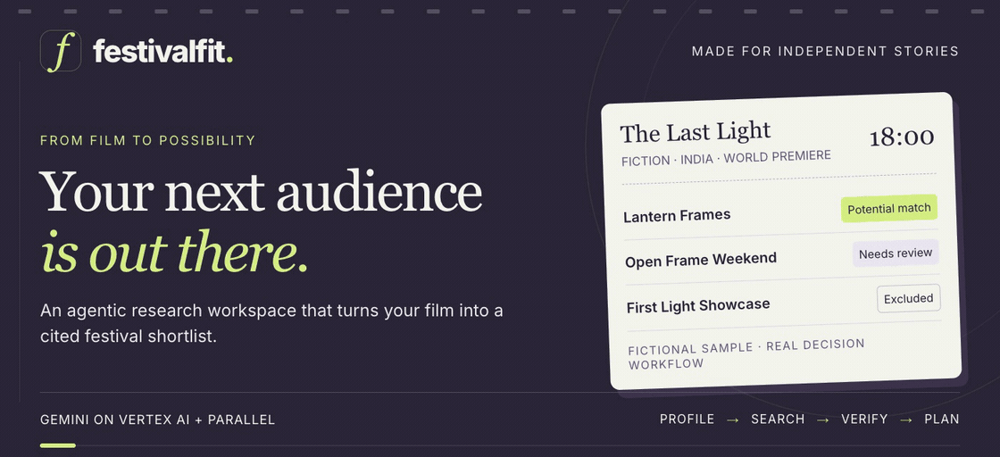
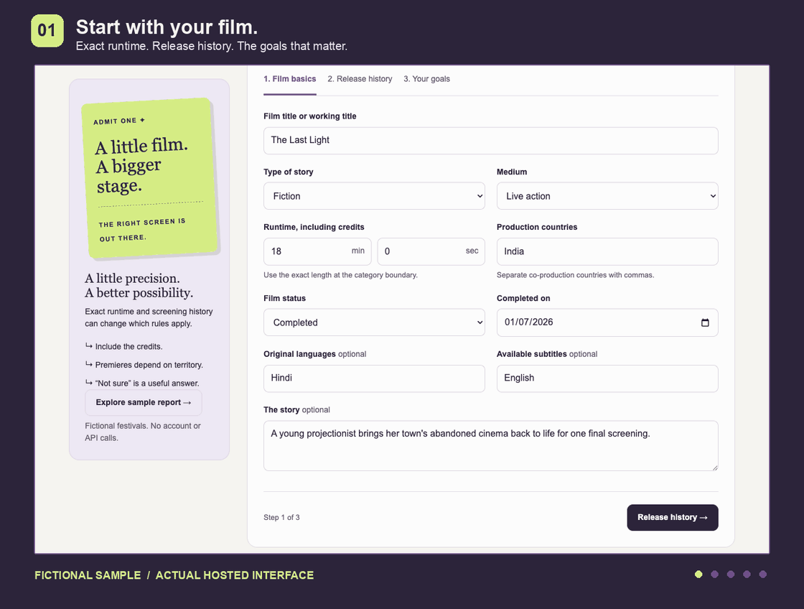
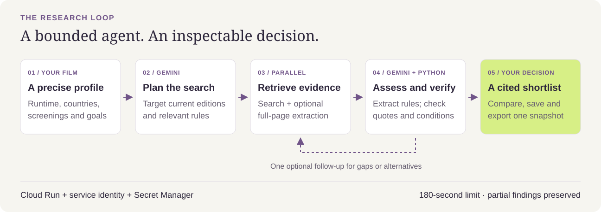
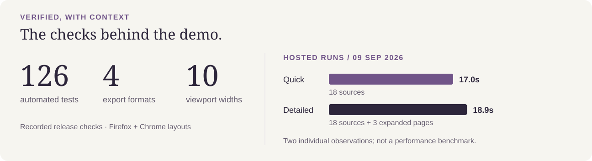

<p align="center">
  <a href="https://festivalfit-1064620464505.us-central1.run.app">
    <picture>
      <source media="(prefers-reduced-motion: reduce)" srcset="docs/assets/hero-poster.png">
      
    </picture>
  </a>
</p>

<p align="center">
  <strong><a href="https://festivalfit-1064620464505.us-central1.run.app">Open the live workspace ↗</a></strong>
  &nbsp; · &nbsp; <a href="#see-the-workspace">Product tour</a>
  &nbsp; · &nbsp; <a href="#inside-the-research-loop">How it works</a>
  &nbsp; · &nbsp; <a href="#run-locally">Run locally</a>
  &nbsp; · &nbsp; <a href="SETUP.md">Deploy</a>
</p>

**FestivalFit helps independent filmmakers build a festival shortlist from cited rules, then compare the deadlines, fees and unresolved conditions before spending money.** Gemini plans and assesses. Parallel retrieves source material. Local validation checks what the evidence supports.

An 18-minute short can fit one category and miss another by three minutes. A previous screening can change its premiere status. The right next move depends on the details.

**Try it in 60 seconds:** open the live workspace → **Explore sample report** → expand a rule → **Compare & plan** → **Export report**. The fictional sample needs no credentials. Live research requires a private demo code.

## See the workspace

<p align="center">
  <picture>
    <source media="(prefers-reduced-motion: reduce)" srcset="docs/assets/tour-poster.png">
    
  </picture>
</p>

*An animated tour assembled from the actual hosted interface, using the clearly labeled fictional sample.* Prefer stills? [Film profile](docs/assets/screens/profile.png) · [Research](docs/assets/screens/research.png) · [Report](docs/assets/screens/report.png) · [Compare & plan](docs/assets/screens/plan.png) · [Export](docs/assets/screens/export.png)

| Your next step | What FestivalFit brings into view |
| --- | --- |
| **Describe the film** | Runtime down to the second, co-productions, languages, subtitles, screening history, prior submissions, student status and budget. |
| **Choose the depth** | A Quick shortlist, Detailed verification with fuller text from up to three pages, or a focused festival recheck. |
| **Inspect the decision** | Edition and category context, quoted requirements, supported checks, blockers, preferences and open questions. |
| **Build a plan** | Compare up to four candidates and save a shortlist. Known fees are totaled separately by currency; unknown fees stay visible. |
| **Take it with you** | **PDF · Markdown · CSV · JSON**, generated from the same report snapshot. Export all candidates or just the saved shortlist. |

## Inside the research loop



This is a connected research workflow. It can inspect its first findings, identify missing rules or unsuitable candidates, and spend **one bounded follow-up** on gaps or alternatives.

1. **Plan.** Gemini uses the film profile and current UTC date to plan targeted searches.
2. **Retrieve.** Parallel Search returns source pages and excerpts. Detailed mode also asks Parallel Extract for fuller text from up to three pages.
3. **Assess.** Gemini extracts festival/category candidates, six core checks and additional material conditions.
4. **Validate.** Python checks quotation presence, edition/category context and supported rule predicates, then derives decisions and next steps.
5. **Refine and deliver.** The browser receives partial findings while the optional follow-up runs, then a final report. Comparison, saved plans and exports use that report's stable ID and schema.

**Runtime:** HTML/CSS/JavaScript → FastAPI on **Google Cloud Run** → `google-genai` calling **Gemini on Vertex AI**, plus `parallel-web` calling **Search / Extract**. A dedicated service identity authenticates to Vertex; Secret Manager supplies the Parallel key and private demo code.

Both research modes have a **180-second total request limit**. A run uses at most two logical searches, one optional Extract request and three logical Gemini calls; SDK retries can add provider attempts. Up to 20 source pages are retained. Keep the tab connected: research is streamed, without durable background jobs.

## Evidence you can question

| Decision | What it means |
| --- | --- |
| **Potential match** | The extracted mandatory checks are supported for the supplied profile. |
| **Needs review** | A material condition, scope question or conflicting piece of evidence remains unresolved. |
| **Excluded** | A supported mandatory requirement conflicts with the film. |

A potential match is not a prediction of selection or proof that every rule was found. Requirements stay separate from preferences. Runtime boundaries include seconds; ambiguous conditions and directly evaluable contradictions remain visible. Confirm the complete, current official rules before paying.

[Read the evidence boundaries, API and privacy details →](docs/TECHNICAL.md)

## Checked on the live stack



The hosted checks exercised **real Vertex and Parallel calls**, partial-to-final streaming, access-code rejection, all four export formats and selected-shortlist scope. Detailed mode expanded three source pages. Firefox and Chrome header layouts were checked from 320px to 1440px, alongside desktop and mobile navigation.

The timings above are **one observed run per mode on September 9, 2026**, not an accuracy or reliability benchmark. [Verification record and reproduction commands](docs/VERIFICATION.md).

## Run locally

Requires **Python 3.12** and [uv](https://docs.astral.sh/uv/getting-started/installation/).

```sh
uv sync --frozen
cp .env.example .env
uv run uvicorn app.main:app --host 127.0.0.1 --port 8765
```

Open [localhost:8765](http://127.0.0.1:8765). The sample works immediately. For live research, configure Vertex AI Application Default Credentials and the Parallel key. An AI Studio key is also supported with `GEMINI_BACKEND=developer`. [Credential setup](SETUP.md#local-setup).

Deploy the Dockerfile with [scripts/deploy-cloud-run.sh](scripts/deploy-cloud-run.sh). The build upload includes only runtime files; no database or frontend build step is required. [Cloud Run setup and cost controls](SETUP.md#deploy-to-google-cloud-run).

<details>
<summary><strong>Practical limits and privacy</strong></summary>

- Film details go to Google; relevant search terms go to Parallel. Provider retention policies apply.
- The server does not persist profiles or reports. Explicitly saved drafts, reports and plans live in this browser until deleted or browser data is cleared. There is no cloud sync.
- Cancellation and partial findings help recover interrupted work. Closing the tab does not create a resumable job.
- Exports omit the synopsis by default. This is not a redaction of every potentially confidential word in evidence or search queries.
- Entry-fee totals do not silently convert currencies. Platform, delivery and travel costs may be additional.
- PDF embeds Latin-script fonts; non-Latin shaping has not been validated. Markdown and JSON retain Unicode.
- Per-process request limits and Cloud Billing alerts are not hard spending caps. Vertex, Cloud services and Parallel have separate usage costs and applicable credits.
- FestivalFit does not submit films or make payments.

[Full technical notes](docs/TECHNICAL.md) · [Costs and deployment](SETUP.md#cost-controls)

</details>

---

<p align="center"><strong>Made for independent stories.</strong><br><a href="LICENSE">MIT License</a> · <a href="https://festivalfit-1064620464505.us-central1.run.app">Find your next audience ↗</a></p>
